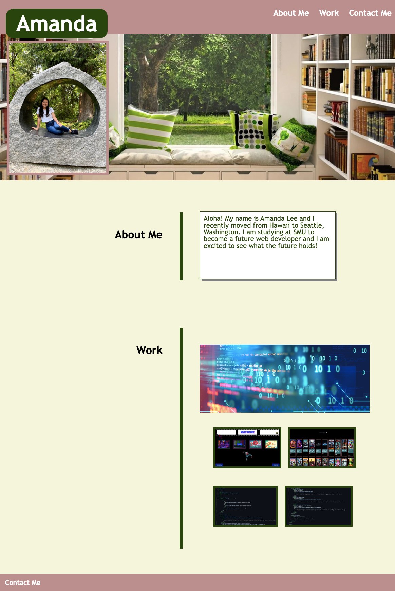

# My Portfolio

Deployed Application: [My Portfolio](https://amandagl1.github.io/Portfolio-of-Amanda/)

## Description

- I was inspired to create a unique portfolio entailing a short introduction about myself and why I decided to join SMU Bootcamp. It also includes previous coding work that I worked on during the bootcamp.
- I built this project to create a space where my work can be featured for future employers to view. The styling of the page represents me and my current skills as a web developer.
- This portfolio allows employers to know me a bit better, view my skills, and contact me through email or phone.
- What I learned while creating this project is that coding requires a lot of patience. There are many new elements and features that I was able to apply into my portfolio including, z-index, psuedo classes, smooth scrolling, etc.

## Screenshots

